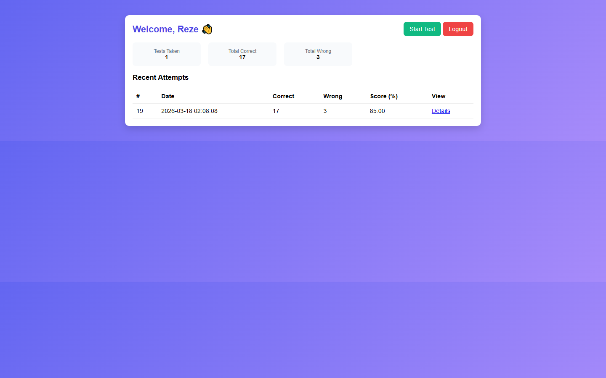
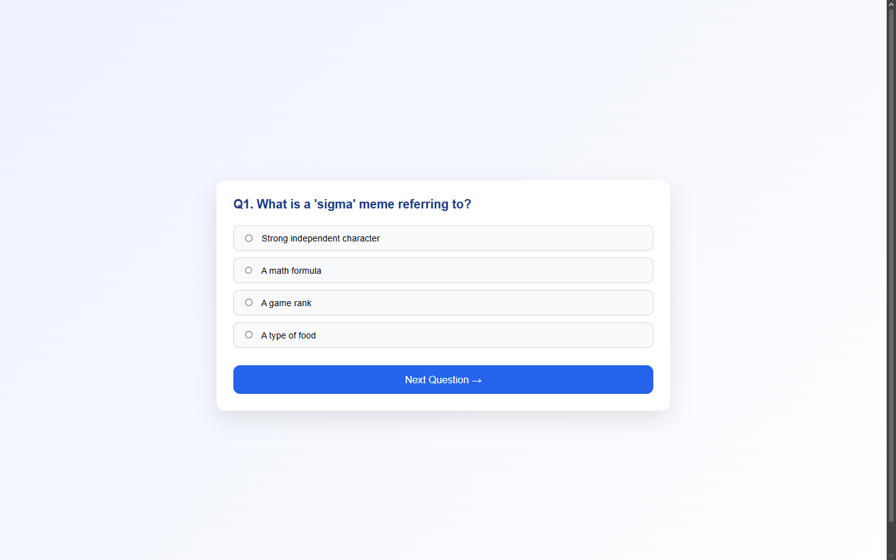
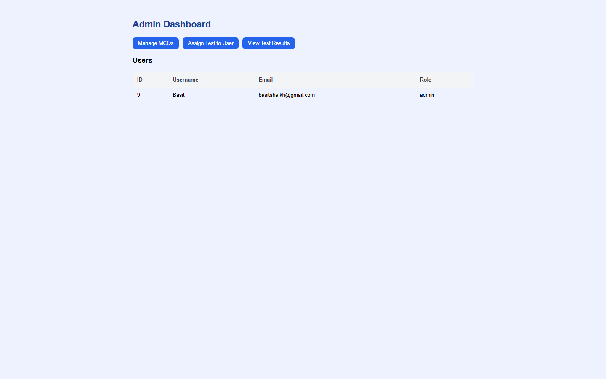
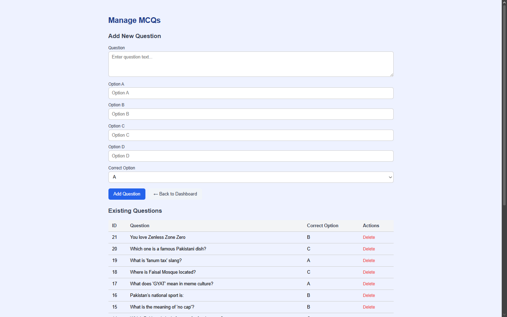

# 📝 MCQ Test System


A web-based Multiple Choice Question (MCQ) test platform built with **PHP** and **MySQL**. It supports two roles — **Admin** and **Student** — both sharing the same login system.

---

## 📸 Screenshots

| Student Dashboard | Taking Test |
|  |  |

| Admin Dashboard | Manage MCQs |
|  |  |

---

## 🚀 Features

### 👨‍💼 Admin
- View all registered users
- Manage MCQ questions (add / delete)
- Assign a custom test to a specific student with a set number of questions
- View all test results across all students
- See detailed per-question breakdown of each student's test

### 👨‍🎓 Student
- Register and log in
- Take assigned MCQ tests
- View past test results on the dashboard
- Review each test in detail — see which answers were correct or wrong

---

## 🗂️ Project Structure

```
/
├── index.php               # Student registration
├── login.php               # Shared login page (admin + student)
├── dashboard.php           # Student dashboard
├── start_test.php          # Test start page
├── take_question.php       # Question display & answer form
├── save_answer.php         # Saves each answer to session
├── submit_test.php         # Grades & saves test results
├── test_detail.php         # Detailed per-question result view
│
└── admin/
    ├── index.php           # Admin dashboard
    ├── manage_mcqs.php     # Add / delete MCQ questions
    ├── assign_test.php     # Assign test to a student
    ├── view_results.php    # View all test results
    ├── logout.php          # Logout & destroy session
```

---

## 🗄️ Database

**Database name:** `login_system`

| Table | Description |
|---|---|
| `users` | Stores all users (students + admins) |
| `mcqs` | Stores all MCQ questions and options |
| `tests` | Stores test summary (score, total, correct, wrong) |
| `user_answers` | Stores each answer submitted per test |
| `test_assignments` | Stores which MCQs are assigned to which user |
| `user_test` | Test different user assign to |

---

## ⚙️ Setup

### 1. Requirements
- PHP 7.4+
- MySQL
- Apache / XAMPP / WAMP

### 2. Installation

```bash
# Clone the repository
git clone https://github.com/your-username/mcq-test-system.git

# Move to your server's root directory
# e.g. htdocs for XAMPP
```

### 3. Database Setup

- Open **phpMyAdmin**
- Create a database named `login_system`
- Import the provided `.sql` file (if included) or create the tables manually

### 4. Configuration

In each PHP file, the DB connection is:

```php
$conn = mysqli_connect("localhost", "root", "", "login_system");
```

Update the credentials if your MySQL setup is different.

---

## 🔐 Roles & Access

Both admins and students use the **same login page** (`login.php`).

| Role | How to set |
|---|---|
| Student | Default role on registration |
| Admin | Manually update `role` column in the `users` table to `admin` |

```sql
UPDATE users SET role = 'admin' WHERE id = 1;
```

> ⚠️ There is no self-registration for admin. Role must be changed directly in the database.

---

## 🛠️ Built With

- **PHP** — Backend logic & session management
- **MySQL** — Database
- **HTML / CSS** — Frontend (Poppins font, custom styling)
- **No frameworks** — Pure vanilla PHP & CSS

---

## 📄 License

This project is open source and free to use for learning purposes.
